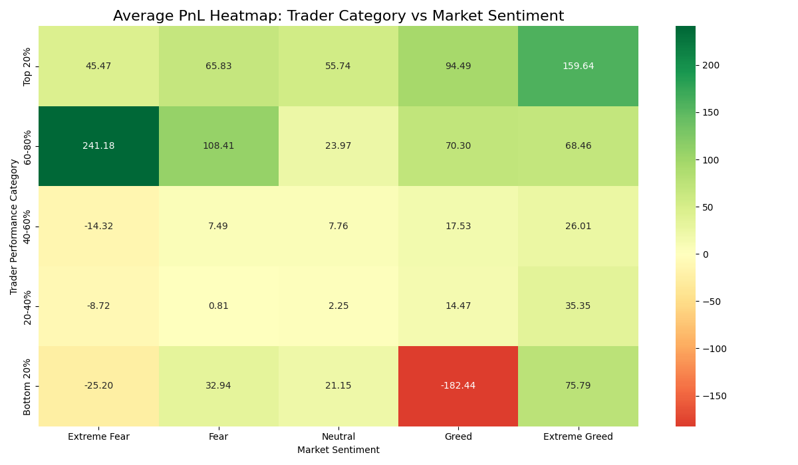

# Bitcoin Market Sentiment & Trader Performance Analysis

This project analyzes the relationship between Bitcoin market sentiment, as measured by the **Fear & Greed Index**, and the trading performance of users on the **Hyperliquid platform**. The objective is to uncover patterns in trader profitability and behavior under different market conditions (e.g., Fear, Greed, Neutral) to inform smarter, sentiment-aware trading strategies.

---

## Key Findings

1.  **Peak Performance During Extreme Greed**: Traders achieved the highest average profits **(\$67.89/trade)** and the highest win rate **(46.5%)** during periods of 'Extreme Greed', suggesting that peak market optimism correlated with the best trading outcomes in this dataset.

2.  **Lowest Profitability in Neutral Markets**: The lowest average profitability **(\$34.31/trade)** occurred during 'Neutral' periods, indicating that a lack of clear market direction was more challenging for traders than periods of high fear.

3.  **Top Traders Capitalize on Greed**: The top 20% of traders (by total PnL) significantly outperformed others during 'Greed' and 'Extreme Greed' phases. This demonstrates their ability to effectively capitalize on market optimism and momentum.

4.  **Weak Correlation with Trade Size**: The analysis revealed a very weak correlation between sentiment score and the size of trades, suggesting that profitability was not simply a function of placing larger bets in certain market conditions but likely depended on strategy.

### Average PnL Heatmap: Trader Category vs. Market Sentiment

The heatmap below visualizes the average profit or loss for each trader category under different market sentiments. The green cells indicate profitability, while red indicates losses.



---

## Usage

To replicate this analysis, follow these steps:

1.  **Clone the Repository:**
    ```bash
    git clone https://github.com/Snack73/trader-sentiment-analysis
    cd trader-sentiment-analysis
    ```

2.  **Install Dependencies:**
    ```bash
    pip install -r requirements.txt
    ```

3.  **Run the Script:**
    ```bash
    python analysis_draft1.py
    ```
    All output files (visualizations and data summaries) will be generated and saved to the `output/` directory.

---

## Data Sources

* **Bitcoin Market Sentiment Dataset**: Daily Fear & Greed Index values with classifications ('Fear', 'Greed', etc.).
* **Historical Trader Data**: Anonymized trading data from Hyperliquid, including execution price, size, side, and PnL for individual trades.

---

## 🛠️ Technologies Used

* **Python**: Core programming language.
* **Pandas**: For data manipulation and analysis.
* **Matplotlib & Seaborn**: For data visualization.
* **Jupyter / Google Colab**: For interactive development.
